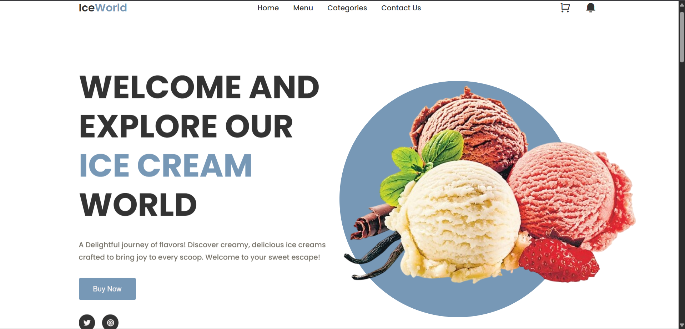

# 🍨 IceWorld — Sweet & Stylish Ice Cream Website

Welcome to **IceWorld**, a user-friendly, responsive, and visually delightful ice-cream website. Built using HTML & CSS, it’s designed for fast performance, accessibility, and delightful user experience!

---

## 🚀 Features

- **Responsive & accessible layout** — adapts from mobile to desktop using CSS Grid & Flexbox  
- **Smooth scrolling** — with `scroll-behavior: smooth` for a pleasant navigation feel  
- **Modern design** — clean UI with Poppins font and consistent color scheme  
- **Optimized buttons & hover effects** — intuitive interactions with transitions  
- **Image performance boosters** — optimized loading and styled elements  
- **Accessible navigation** — mobile-friendly menu button, desktop menu + icons

---

##👀 Preview

---

## 🧩 Core CSS Highlights

- CSS variables for streamlined theming  
- Global reset and `box-sizing: border-box`  
- `.section__container`, `.btn`, `.nav`, and utility classes  
- Hover transitions (buttons, cards)  
- Mobile-first layout, progressively enhanced with media queries

---

## ⚙️ Optimization Tips

- **Lazy-load images**: `loading="lazy" decoding="async"`  
- **Define `width`/`height`** attributes to prevent CLS  
- **Use WebP/AVIF with `<picture>` fallbacks**  
- **Minify CSS** and inline critical styles  
- **Enable Brotli/Gzip** and leverage long browser caching  
- **Host assets via CDN** for faster content delivery  
- **Preload key assets** like hero images using `<link rel="preload">`

---

## 🧪 Testing & Metrics

- Run **Lighthouse** or **WebPageTest** to monitor CLS, LCP, and FID  
- Continuously **audit CSS** for unused code using tools like **PurgeCSS**

---

## 🎉 Credits

- Fonts: **Google Fonts – Poppins**  
- Icons: **Remixicon**  
- Design & build by **Khushi Chetule**, for **IceWorld**

---

Thanks for checking out **IceWorld**!  

Need help setting up image optimization, lazy loading, or build automation? I’m happy to lend a scooping hand! 🍦

